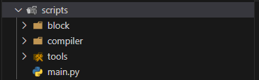
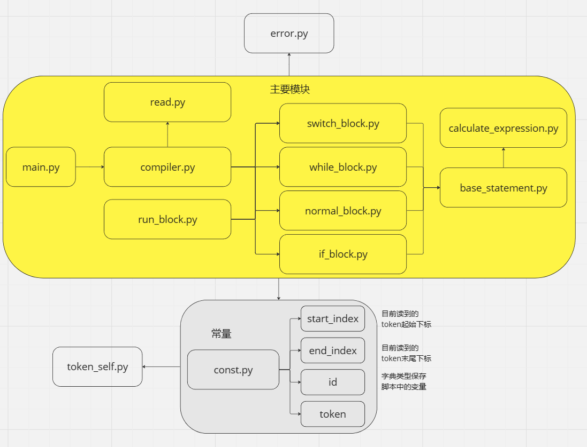
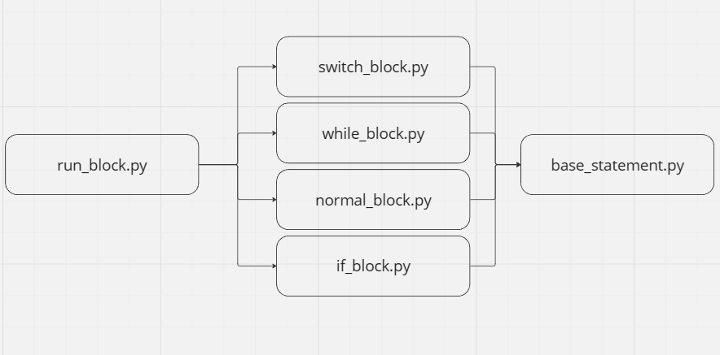
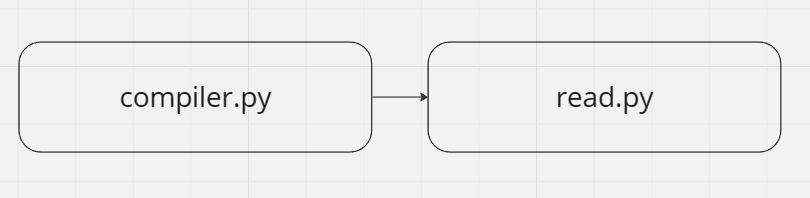
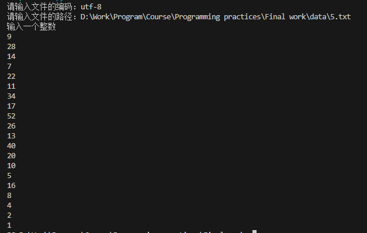
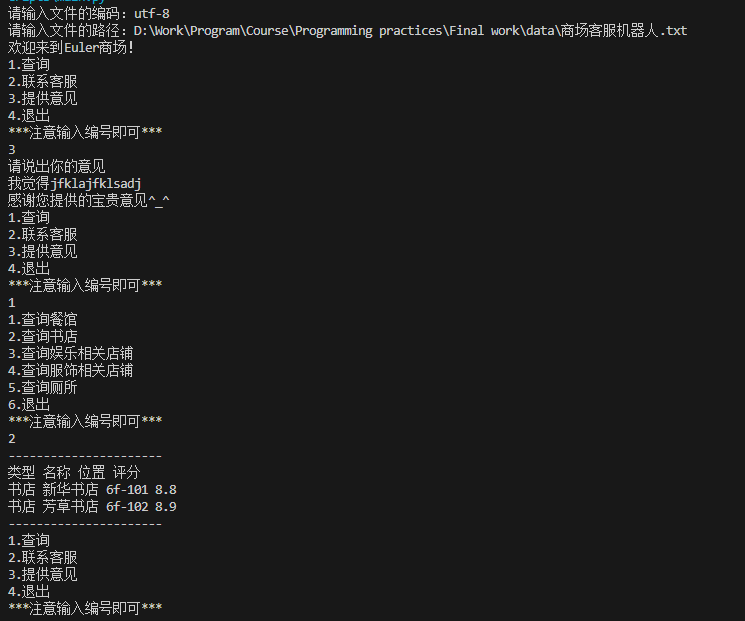

# 程序设计
## 一、要求
### 1.描述
领域特定语言（Domain Specific Language，DSL）可以提供一种相对简单的文法，用于特定领域的业务流程定制。本作业要求定义一个领域特定脚本语言，这个语言能够描述在线客服机器人（机器人客服是目前提升客服效率的重要技术，在银行、通信和商务等领域的复杂信息系统中有广泛的应用）的自动应答逻辑，并设计实现一个解释器解释执行这个脚本，可以根据用户的不同输入，根据脚本的逻辑设计给出相应的应答。

### 2.基本要求
- 脚本语言的语法可以自由定义，只要语义上满足描述客服机器人自动应答逻辑的要求。

- 程序输入输出形式不限，可以简化为纯命令行界面。

- 应该给出几种不同的脚本范例，对不同脚本范例解释器执行之后会有不同的行为表现。
### 3.评分标准
本作业考察学生规范编写代码、合理设计程序、解决工程问题等方面的综合能力。满分100分，具体评分标准如下：

- 风格：满分15分，其中代码注释6分，命名6分，其它3分。

- 设计和实现：满分30分，其中数据结构7分，模块划分7分，功能8分，文档8分。

- 接口：满分15分，其中程序间接口8分，人机接口7分。

- 测试：满分30分，测试桩15分，自动测试脚本15分。

- 记法：满分10分，文档中对此脚本语言的语法的准确描述。

注意：抄袭或有意被抄袭均为0分

## 二、代码设计
代码的中的中文编码是utf-8\
\

### 1.main.py
主函数，要求用户输入中文编码的类型和脚本文件的地址。
### 2.block
代码块文件夹，脚本语言代码块运行的代码块，主要有普通代码模块，IF代码模块，WHILE代码模块，SWITCH代码模块。普通代码又分为赋值语句，声明语句。
\
这里解释一下各个代码块的核心运行逻辑
* 普通代码块，普通代码块就以句号结尾，每次读取一个字符判断为什么语句，然后执行相应的函数。
* IF代码块
    ```
    ('if', '若')('id', '苹果')
    ('==', '同')('num', '1')(',', '，')('then', '则')('if', '若')
    ('id', '香蕉')('==', '同')('num', '6')(',', '，')('then', '则')
    ('id', '香蕉')('+', '加')('num', '3')('=_', '也')('.', '。')
    ('id', '苹果')('+', '加')('num', '5')('=_', '也')('.', '。')
    ('end', '终')('!', '！')('id', '询问')('=', '为')('str', '2022年')
    ('.', '。')('end', '终')(';', '；')('else', '非者')('id', '香蕉')
    ('-', '减')('num', '1')('=_', '也')('.', '。')('if', '若')
    ('id', '苹果')('<', '小')('num', '5')(',', '，')('then', '则')
    ('id', '苹果')('-', '减')('num', '5')('=_', '也')('.', '。')
    ('end', '终')(';', '；')('else', '非者')('id', '苹果')('+', '加')
    ('num', '1')('=_', '也')('.', '。')('end', '终')('!', '！')
    ('id', '询问')('=', '为')('str', '2023年')('.', '。')('end', '终')
    ('!', '！')
    ```
    ```PY
    if Bif.checkIfBlockEnd(len_num, mid, end) is None:
        return enums.ERROR
    if val:  # val 为 True  或者是 False
        if runBlock(len_num, mid) is not None:
            const.start_index = end
        else:
            return enums.ERROR
    else:
        if mid != end:  # 不等说明有else mid 指向else，相等指向下一个待执行语句，不用 +1
            const.start_index = mid + 1
        else:
            const.start_index = mid
        if runBlock(len_num, end) is None:
            return enums.ERROR
    return enums.OK
    ```
    指针先指向if，然后判断后面的逻辑表达式的真假性，通过真假性确定指针转跳到位置。记录这个if语句结束的位置，然后寻找if语句是否有else，如果有那么记录else的位置。上述如果逻辑表达式为真，那么从第一个then后方开始递归调用`run_block`，终止条件为开始指针等于end，之后`run_block`检测到有为if语句，然后又递归调用执行if语句的代码，计算该层if的结束位置，通过一个栈来记录if的个数，遇到!弹栈。然后又递归调用`run_block`，循环往复直到开始指针等于end。
* WHILE代码块
    ```PY
    start = const.start_index
    val = Bwhile.checkWhileBlockFront(len_num)
    if val is None:
        return enums.ERROR
    if val:  # val 为 True 或者 False
        if runBlock(len_num, end) is not None:  # 执行while代码块
            const.start_index = start  # 执行结束改变指针
            return whileBlock(len_num, end)  # 递归条用
        else:
            return enums.ERROR
    else:  # 递归结束出口
        const.start_index = end
    return enums.OK
    ```
    和IF代码块的区别在于要直到逻辑表达式为假才终止循环`const.start_index = end`，也就是跳过while语句，否则每次都把开始指针指向while语句的开始字符。
* SWITCH代码块
    ```
    ('float', '有数曰')(':', '：')('id', '苹果')('=', '为')('num', '3')
    (',', '，')('id', '香蕉')('.', '。')('input', '受')(':', '：')
    ('id', '香蕉')('.', '。')('id', '香蕉')('switch', '者')(':', '：')
    ('case', '若为')('num', '1')(',', '，')('then', '则')('print', '曰')
    (':', '：')('str', '10')('.', '。')('end', '终')(';', '；')
    ('case', '若为')('num', '2')(',', '，')('then', '则')('print', '曰')
    (':', '：')('str', '20')('.', '。')('end', '终')(';', '；')
    ('else', '非者')('print', '曰')(':', '：')('str', '非者')('.', '。')
    ('end', '终')('!', '！')('print', '曰')(':', '：')('str', '苹果：')
    ('+', '+')('id', '苹果')('.', '。')
    ```
    ```PY
    index, char = tool.updateIndex()
    while index < end:
        if char == "case":  # 检测case
            const.start_index = index  # 更新下标
            match = Bswitch.checkSwitchBranch(len_num, name)
            if match is None:
                return enums.ERROR
            if match:  # 如果两个值相等了，就退出
                if runBlock(len_num, end) is None:
                    return enums.ERROR  
                break
        elif char == "else":  # 检测else
            index, char = tool.forwordIndex(index)
            const.start_index = index  # 让开始指针指向正确位置
            runBlock(len_num, end)
            break
        elif char == "switch":  # 需要跳过switch 语句
            index = Bwhile.divideWhileSwitchBlock(len_num, end) - 1  # 指向！就好了
            char = const.token.getType(index)  # 更新字符
            continue
        index, char = tool.forwordIndex(index)
    return enums.OK
    ```
    SWITCH语句块通过对每个case的检测来觉得是否执行，如果都没有则执行else，如果没有else那么就会检测到结尾也就相当于执行完了SWITCH语句。
* 普通语句块就顺序执行，对于指针没有太多的操作，其他语句对指针的操作比较多。
### 3.compiler
解释器，采用扫描一遍的形式，扫描到哪里翻译到哪里。read读取文件，compiler通过read划分的语句块逐块识别语句。

### 4.tools
工具文件夹，包含一些代码用到的工具函数和常量。期中包含对算数运算、逻辑运算、比较运算的检测和求值，以及指针的偏移计算。

## 三、测试
### 测试桩
该项目的测试桩函数为一个连接外部客户的函数\
脚本中的语法为`信：字符串`\
内部识别语句的函数
```PY
def compileConnect(len_num):
    """执行连接客服函数，返回后的指针指向.

    Args:
        len_num (integer): 现在读取到哪一行，用于进行报错处理

    Returns:
        * None 代表检测到错误
        * 1 代表语句执行成功。
    """
    const.start_index, char = tool.forwordIndex(const.start_index)
    if char != ":":
        return errorExpect(":", len_num)
    const.start_index, char = tool.forwordIndex(const.start_index)
    string = base.strExpression(len_num)
    if string is not None:
        tool.connectTestPile(string)
    else:
        return enums.ERROR
    return enums.OK
```
测试桩函数，简单实现了这个功能，保证程序正常运行。
```PY
def connectTestPile(_):
    """连接函数的测试桩

    Args:
        _ (string): 用于接收连接对象的参数，但是对于测试桩来说不重要
    """
    string = input("请问你有什么问题吗？\n")
    while string.find("结束") == -1 and string.find("挂断") == -1:
        if string.find("投诉") != -1:
            string = input("请说出你的问题，我们会改进的^_^\n")
            string = input("以收到你的回复，请问还有什么问题吗？\n")
        elif string.find("点评") != -1:
            string = input("请说出你的评价，我们仔细聆听的^_^\n")
            string = input("以收到你的回复，请问还有什么问题吗？\n")
        elif string.find("点评") != -1:
            string = input("请说出你的评价，我们仔细聆听的^_^\n")
            string = input("以收到你的回复，请问还有什么问题吗？\n")
        else:
            string = input("很抱歉我们没有听清楚，请重新说。输入结束或者挂断结束对话。\n")
    print("感谢您的来电，祝您生活愉快^_^")
```
### 自动测试
```BAT
@echo off

set "EXE_FOLDER=D:\Work\Program\Course\Programming practices\Final work\test\input"
set "PYTHON_SCRIPT=D:\Work\Program\Course\Programming practices\Final work\scripts\main.py"
set "OUTPUT_FOLDER=D:\Work\Program\Course\Programming practices\Final work\test\output"

echo Starting script...

for %%i in ("%EXE_FOLDER%\*.txt") do (
    echo Processing file: %%i
    type "%%i" | python "%PYTHON_SCRIPT%" >> "%OUTPUT_FOLDER%\output_%%~ni.txt"
)
```

## 四、实例
### 1.实现3n+1猜想
* 脚本语言
    ```
    有数曰：甲，乙。
    曰：“输入一个整数”。
    受：甲。
    凡甲非同1，则
        乙为甲除2。
        若甲同乙乘2，则 # 说明甲可以被2整除
            甲为乙。
            终；
        非者
            甲为3乘甲加1。
        终！
        曰：甲。
    终！
    ```
* 终端结果

* 文件输出
```
('float', '有数曰')(':', '：')('id', '甲')(',', '，')('id', '乙')
('.', '。')('print', '曰')(':', '：')('str', '输入一个整数')('.', '。')
('input', '受')(':', '：')('id', '甲')('.', '。')('while', '凡')
('id', '甲')('!=', '非同')('num', '1')(',', '，')('then', '则')
('id', '乙')('=', '为')('id', '甲')('/', '除')('num', '2')
('.', '。')('if', '若')('id', '甲')('==', '同')('id', '乙')
('*', '乘')('num', '2')(',', '，')('then', '则')('id', '甲')
('=', '为')('id', '乙')('.', '。')('end', '终')(';', '；')
('else', '非者')('id', '甲')('=', '为')('num', '3')('*', '乘')
('id', '甲')('+', '加')('num', '1')('.', '。')('end', '终')
('!', '！')('print', '曰')(':', '：')('id', '甲')('.', '。')
('end', '终')('!', '！')
```
### 2.商场机器人
* 脚本语言
    ```
    曰：“欢迎来到Euler商场！”。
    有爻曰：结束为阴。
    有数曰：答案。
    凡 结束同阴，则
        曰：“1.查询”。曰：“2.联系客服”。曰：“3.提供意见”。
        曰：“4.退出”。曰：“***注意输入编号即可***”。
        受：答案。
        答案者：
        若为1，则
            曰：“1.查询餐馆”。曰：“2.查询书店”。曰：“3.查询兴趣班”。 曰：“4.查询超市”。
            曰：“5.查询厕所”。曰：“6.退出”。曰：“***注意输入编号即可***”。
            受：答案。
            答案者：
                若为1，则 寻：“餐馆”。终；
                若为2，则 寻：“书店”。终；
                若为3，则 寻：“娱乐”。终；
                若为4，则 寻：“服饰”。终；
                若为5，则 寻：“厕所”。终；
                若为6，则 结束为阳。终；
                非者 曰：“请输入合法的数字。”。
            终！
        终；
        若为2，则
            曰：“正在联系客服...”。
            # 这里新加一个函数来处理连续操作
            曰：“联系结束”。
        终；
        若为3，则
            有言曰：意见。
            曰：“请说出你的意见”。
            获：意见。
            曰：“感谢您提供的宝贵意见^_^”。
        终；
        若为4，则 结束为阳。终；
        非者 曰：“请输入合法的数字。”。
        终！
    终！
    ```
* 终端结果

* 文件输出
```
('print', '曰')(':', '：')('str', '欢迎来到Euler商场！')('.', '。')('bool', '有爻曰')
(':', '：')('id', '结束')('=', '为')('false', '阴')('.', '。')
('float', '有数曰')(':', '：')('id', '答案')('.', '。')('string', '有言曰')
(':', '：')('id', '意见')('.', '。')('while', '凡')('id', '结束')
('==', '同')('false', '阴')(',', '，')('then', '则')('print', '曰')
(':', '：')('str', '1.查询')('.', '。')('print', '曰')(':', '：')
('str', '2.联系客服')('.', '。')('print', '曰')(':', '：')('str', '3.提供意见')
('.', '。')('print', '曰')(':', '：')('str', '4.退出')('.', '。')
('print', '曰')(':', '：')('str', '***注意输入编号即可***')('.', '。')('input', '受')
(':', '：')('id', '答案')('.', '。')('id', '答案')('switch', '者')
(':', '：')('case', '若为')('num', '1')(',', '，')('then', '则')
('print', '曰')(':', '：')('str', '1.查询餐馆')('.', '。')('print', '曰')
(':', '：')('str', '2.查询书店')('.', '。')('print', '曰')(':', '：')
('str', '3.查询娱乐相关店铺')('.', '。')('print', '曰')(':', '：')('str', '4.查询服饰相关店铺')
('.', '。')('print', '曰')(':', '：')('str', '5.查询厕所')('.', '。')
('print', '曰')(':', '：')('str', '6.退出')('.', '。')('print', '曰')
(':', '：')('str', '***注意输入编号即可***')('.', '。')('input', '受')(':', '：')
('id', '答案')('.', '。')('id', '答案')('switch', '者')(':', '：')
('case', '若为')('num', '1')(',', '，')('then', '则')('find', '寻')
(':', '：')('str', '餐馆')('.', '。')('end', '终')(';', '；')
('case', '若为')('num', '2')(',', '，')('then', '则')('find', '寻')
(':', '：')('str', '书店')('.', '。')('end', '终')(';', '；')
('case', '若为')('num', '3')(',', '，')('then', '则')('find', '寻')
(':', '：')('str', '娱乐')('.', '。')('end', '终')(';', '；')
('case', '若为')('num', '4')(',', '，')('then', '则')('find', '寻')
(':', '：')('str', '服饰')('.', '。')('end', '终')(';', '；')
('case', '若为')('num', '5')(',', '，')('then', '则')('find', '寻')
(':', '：')('str', '厕所')('.', '。')('end', '终')(';', '；')
('case', '若为')('num', '6')(',', '，')('then', '则')('id', '结束')
('=', '为')('true', '阳')('.', '。')('end', '终')(';', '；')
('else', '非者')('print', '曰')(':', '：')('str', '请输入合法的数字。')('.', '。')
('end', '终')('!', '！')('end', '终')(';', '；')('case', '若为')
('num', '2')(',', '，')('then', '则')('print', '曰')(':', '：')
('str', '正在联系客服...')('.', '。')('print', '曰')(':', '：')('str', '联系结束')
('.', '。')('end', '终')(';', '；')('case', '若为')('num', '3')
(',', '，')('then', '则')('print', '曰')(':', '：')('str', '请说出你的意见')
('.', '。')('input', '获')(':', '：')('id', '意见')('.', '。')
('print', '曰')(':', '：')('str', '感谢您提供的宝贵意见^_^')('.', '。')('end', '终')
(';', '；')('case', '若为')('num', '4')(',', '，')('then', '则')
('id', '结束')('=', '为')('true', '阳')('.', '。')('end', '终')
(';', '；')('else', '非者')('print', '曰')(':', '：')('str', '请输入合法的数字。')
('.', '。')('end', '终')('!', '！')('end', '终')('!', '！')

```

## 五、遇到的问题
遇到很多问题
* 由于书写代码初期对于每一个执行语句后的指针定位不清晰，导致了原本已经执行好了的代码，由于指针没有移动从而再次执行，获知开始指针指向了错误位置导致错误。例如有些代码执行完成后指针指向了.而有的代码指向完成后指针指向了.的前一位。
  * 解决方法：严格规定每个代码执行后指针指向的位置，在该解析器中，普通语句执行完成后指针都执行了.，而IF，WHILE和SWITCH语句执行完成后指针统一指向下一个待执行的语句。
* 由于在词法分析的时候对语句进行了粗略的划分，所以最开始以为，每一个IF，WHILE和SWITCH语句块都能被词法分析划分。其实这是错误的，因为如果存在IF，WHILE和SWITCH语句块的嵌套的情况那么就会出现错误。比如如下脚本，词法分析只能识别`曰：询问。`语句后面到`曰：“苹果：”+苹果。`为一个IF语句，但是不能检测到内层的IF语句或者其他语句。
    ```
    有数曰：苹果为3，香蕉为苹果加3也。
    有言曰：询问为“1234”+“年后”。
    有爻曰：假为阴或1大2或3小10，而为阳。
    苹果加3也。
    曰：“苹果：”+苹果。
    曰：“香蕉：”+香蕉。
    受：而。
    曰：而。
    曰：询问。
    若苹果同1，则
        若香蕉同6，则
            香蕉加3也。# 如果成立那么香蕉的数目为43
            苹果加5也。
            终！
        询问为“2022年”。
        终；
    非者
        香蕉减1也。
        若苹果小5，则
            苹果减5也。
            终；
        非者
            苹果加1也。
        终！
        询问为“2023年”。
    终！
    曰：“苹果：”+苹果。
    曰：“香蕉：”+香蕉。
    曰：询问。
    ```
  * 解决方法：使用递归调用的形式执行语句，例如
    ```PY
    if Bif.checkIfBlockEnd(len_num, mid, end) is None:
        return enums.ERROR
    if val:  # val 为 True  或者是 False
        if runBlock(len_num, mid) is not None:
            const.start_index = end
        else:
            return enums.ERROR
    else:
        if mid != end:  # 不等说明有else mid 指向else，相等指向下一个待执行语句，不用 +1
            const.start_index = mid + 1
        else:
            const.start_index = mid
        if runBlock(len_num, end) is None: # 递归调用，执行代码
            return enums.ERROR
    return enums.OK
    ```
* 没有考虑到上一个IF，WHILE和SWITCH语句块结束，下方还有普通语句的情况，因为之前是直接使用词法分析返回的end_index作为每个语句的结束。
  ```TXT
  若苹果同1，则
        若香蕉同6，则
            香蕉加3也。# 如果成立那么香蕉的数目为43
            苹果加5也。
            终！
        询问为“2022年”。 # 这种情况，这样这一行语句不会执行
        终；
    非者
        香蕉减1也。
        若苹果小5，则
            苹果减5也。
            终；
        非者
            苹果加1也。
        终！
        询问为“2023年”。
    终！
  ```
  * 解决方法，不能直接采用从词法分析返回的end_index，这个是整个语句的结束，可以作为终极约束但是不能作为每次递归的约束，每次递归调用都需要重新计算end值。
* 比较逻辑运算问题，一直出错。例如：`1大2且3小4或阴且2同3`，对于这个语句本人没有想到直接处理的办法，但是采用了一种比较取巧的方法，实现了对逻辑运算的求解
  * 解决方法：分配两个容器`compare`和`tokens`，`compare`保存出现的单个符号或者出现的比较逻辑。例如上述逻辑运算`1大2且3小4或阴且2同3`，先读取`1大2`然后计算其值为`fasle`，计算好后清空`compare`，将该值保存到`tokens`中，遇到`且`将`and`保存到`tokens`。遇到阴，先保存到`compare`中然后通过计算返回`false`，清空`compare`，将该值保存到`tokens`中。最后`tokens`为`['fasle', 'and', 'false', 'or', 'false', 'and', false']`然后再通过函数计算出最终的数值。当然在计算之前都要检测表达式是否合法。
* 由于错误采用的是None的值，最开始这样设计是因为None可以方便检测所以代码写成了如下写形式
    ```PY
    val = base.assignment2(len_num)
    if val:  # 不为None
        const.start_index, char = tool.forwordIndex(const.start_index)
        if char == ".":  # 保证都以.结束
            return val
        else:
            return errorExpect(".", len_num)
    return val
    ```
    这样的写法是错误的，因为如果val返回0/False那么就有可能导致需错误判断失败，改为如下代码
    ```PY
    val = base.assignment2(len_num)
    if val is not None:  # 不为None
        const.start_index, char = tool.forwordIndex(const.start_index)
        if char == ".":  # 保证都以.结束
            return val
        else:
            return errorExpect(".", len_num)
    return val
    ```
    这个问题是在测试如下脚本的时候出现的
    ```TXT
    有数曰：苹果为3，香蕉。
    曰：“输入香蕉的值。”。
    受：香蕉。
    若 香蕉小3且香蕉大0，则
        曰：“分支1”。
        凡 香蕉大0，则 # 这里由于出现了0导致了，报错脚本执行失败
            香蕉减1也。
            苹果加1也。
            曰：“苹果：”+苹果。
            曰：“香蕉：”+香蕉。
        终！
        香蕉加1也。
        曰：“苹果：”+苹果。
        曰：“香蕉：”+香蕉。
        终；
    非者
        曰：“分支2”。
        凡 苹果大0，则
            香蕉加1也。
            苹果减1也。
            曰：“苹果：”+苹果。
            曰：“香蕉：”+香蕉。
        终！
        苹果加1也。
        曰：“苹果：”+苹果。
        曰：“香蕉：”+香蕉。
    终！
    曰：“你好！”。
    ```
    需要将所有错误判断都改为，不能简单地采用`if val:`
    ```PY
    val = base.assignment2(len_num)
    if val is not None:  # 不为None
    ```

## 六、总结
* 明确自己的脚本语言，按照脚本语言的定义写解析器。
* 明确每个语句块结束后的指针指向，避免出现错误，指针非常重要。
* 明确返回值的类型，对特定的返回值做特定的检测。在完成某一个模块的时候就应该测试代码，避免后续出现bug，对代码的大幅度更改。
* 遇到难以解决的问题时，将问题分解为小问题，然后解决处理。
* 通过这次程序设计知道了如何划分模块，版本1.0的所有模块都写到了一个模块中，导致可读性极差，代码长度也很长。随着版本的迭代，首先检查处理一系列bug，紧接着提高了代码的可读性。
* 要找到关键问题，该程序的关键问题就是解决读取检测算数表达式、读取检测逻辑表达式、读取检测比较运算符。因为在代码的多处都会调用这些代码，例如IF语句WHILE语句需要调用后两个，赋值语句有可能调用全部，所以这些关键函数需要写好写对。之后站在语句块的角度上，IF, WHILE, SWITCH 语句，这三种语句在逻辑上都是移动开始指针，然后执行合适位置的子语句，所以写好普通语句是很重要的。在写程序的每一步中确定关键问题，前期考虑各种表达式的计算，中期考虑各种子语句的执行，最后将各种表达式语句有机联系在一起，最终是实现整个程序。