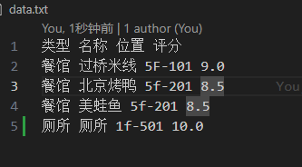

# 脚本语言语法
### 关键字
* 类型关键字
    ```
    有数曰 有言曰 有爻曰
    ```
* 赋值关键字
    ```
    为 也
    ```
* 运算关键字
    ```
    加 减 乘 除 + - * /
    ```
* 条件循环关键字
    ```
    若 则 非者 凡 终 者 若为
    ```
* 逻辑关键字
    ```
    同 且 或 小 大 非同 非大 非小
    ```
* 函数关键字
    ```
    曰 获/得/受
    ```
### Token对应表
```TXT
有数曰 --> float
有言曰 --> string
有爻曰 --> bool
为 --> =
也 --> =_
加 --> +
减 --> -
乘 --> *
除 --> /
+ --> +
- --> -
* --> *
/ --> /
若 --> if
若为 --> case
则 --> then
凡 --> while
终 --> end
者 --> switch
同 --> == 
且 --> and
或 --> or
小 --> <
大 --> >
非同 --> != 
非大 --> <=
非小 --> >= 
非者 --> else 
曰 --> print
获 --> input
得 --> input
受 --> input
寻 --> find
阴 --> false
阳 --> true
！ --> !
： --> :
， --> ,
。 --> .
； --> ;
“……” --> str # 代表字符串实例
数字 --> num
```
### 语法规则
* 单词
    * 每个单词均由汉字组成，所有关键字中的符号均是中文下的符号。除此之外都不能构成单词，这种错误会在词法分析时候报错并终止程序。
    ```TXT
    有数曰：apple为3，香蕉为苹果加3也。 # apple是错误的
    有言曰:询问为“1234”+“年后”。 # :是错误的
    有爻曰：假为阴或1大2或3小10，而为True。 # True是错误的
    ```
    * 注意变量名字的检测优先级低于关键字的检测，所以变量名请不要使用关键字，使用某些关键字可能会报错并终止，也有可能会弹出错误不终止。所以请不要在变量名中出现关键字。
    ```TXT
    有爻曰：终止为阴。 # 这里的终止的终为关键字，所以导致会报告错误，并终止程序。
    ```
* 语句
    * 普通语句以`。`结束，特殊的`if, while, switch`语句以`终！`结尾。
    * 解析器解析脚本时是逐行解析，如果没有出现在词法分析中出现的错误，也就是没有错误的变量出现，那么就会执行到能检测到错误的位置报告错误然后终止程序。
    * 一个语句中不能出现无用语句，也就是对变量没有产生任改变，没有输入输出的语句。代码中不能出现无用语句，这样会报错处理。无用语句也就是下述的子句，下述子句单独作为一个语句的时候不会对变量的数值产生任何影响，但是他们又参与赋值逻辑判断等操作，所以命名为子句。有用的语句为：声明语句、赋值语句、if语句、while语句、switch语句、函数语句。解析器对于无用字句的操作为直接跳过该语句，所以如果没有检测为有用语句会直接跳过，所以这几行的代码如果产生了错误会直接跳过，会弹出警告，不终止程序。本人建议只在代码中写有用语句。
    ```TXT
    有数曰：苹果为3，香蕉为苹果加3也。
    有言曰：询问为“1234”+“年后”。
    有爻曰：假为阴或1大2或3小10，而为阳。
    阴或1大2或3小10。 # 该行语句就是无用语句，编译器会直接跳过，并弹出警告，终止程序。
    ，你好 # 这里也是无用语句，但是它不满足语法要求，终止程序，会弹出警告。
    苹果加3也。
    曰：“苹果：”+苹果。
    曰：“香蕉：”+香蕉。
    受：而。
    曰：而。
    曰：询问。
    ```
* 算数运算子句（表达式语句）\
其中不能有赋值语句和声明语句，运算语句也就是整数和浮点数的加减乘除法，其中所有变量的类型都必须为`有数曰`
    ```TXT
    1+2*3+4。 # 字面意思，注意这里没有（）用于提高某些运算符的优先集
    ```
    算数表达式和普通的算术表达式一样，注意没有括号，乘除法的优先级，大于加减法。加等价于+再代码中可用互换，减等价于-，乘等价于*，除等价于/。注意除法对于两个整数来说的是整除，只有当有一方是小数，才是小数除法，除数不可以为0。
    ``` 
    1加3乘4。 # 表示1+2*3
    1+3*3。
    ```
    加3等价于+3，减3等价于-3，这样的写法是允许的，这作为一个单独的数而不是算数表达式。但是本人推荐使用+或者-代表正数或者负数。

* 逻辑子句/判断子句
    ```
    同 非 且 或 小 大
    ```
    `a同b`：判断a是否等于b\
    `a小b`：判断a是否小于b\
    `a大b`：判断a是否大于b\
    `P(x)且G(y)`：判断命题P(x)和命题G(y)是否同时成立\
    `P(x)或G(y)`：判断命题P(x)和命题G(y)是否有一个成立\
    `非`：表示不，可用用来和其他逻辑关键字组合\
    `a非同b`：判断a是否不等于b\
    `a非大b`：判断a是否小于等于b\
    `a非小b`：判断a是否大于等于b\
    其中a和b为表达式\
    判断结果为真返回阳，为假返回阴\
    其中a和b可以为变量、数字、数字表达式、第二类赋值语句，P(x)，G(y)代表一个可以计算的真值，可以是比较运算、数字、变量，不可以是字符串。其中也可以进行且和或的嵌套。
    ```TXT
    阴或1大2或3小10。 # False or 1 > 2 or 3 < 10
    ```

* 字符串连接子句\
类似于python的字符串+操作
    ```TXT
    “你好，”+“世界！”。 # 最终为“你好，世界！”
    ```
* 声明语句\
`类型关键字`：变量名\
`类型关键字`：变量名`为`数值\
`类型关键字`：变量名1`为`数值1，变量名2`为`数值2，……，变量名n`为`数值n。\
`为`可以理解为`=`的意思
    ```
    有数曰：苹果为3，香蕉为4。
    有言曰：询问为“1234”。
    有爻曰：真为阳，假为阴。
    ```
一共只有三种类型的变量，`有数曰`、`有言曰`、`有爻曰`
  * `有数曰`：代表变量类型是一个数字，其中如果传递整数那么它就是整数，分数就是分数。
  * `有言曰`：代表字符串类型。
  * `有爻曰`：代表布尔类型。
在声明语句中可以声明变量并赋值，也可以只声明变量。
已经声明的变量不可以再次声明。
* 赋值语句\
变量名`为`数值。（第一种赋值语句）\
变量名`运算符也`（第二种赋值语句）。
    ```
    有数曰：苹果。
    苹果为3。
    苹果加3也。
    ```
    //最后苹果的值为6\
  * 第一种赋值语句要求`为`字的左边为一个变量，右边为一个相应类型的变量或者常量。
    * 数字类型：右值可以为数字类型的变量和数字的算数运算操作，可以只有数字，或者只有变量，或者两者都有，变量必须初始化。
        ```TXT
        甲为1+2+3*4。# 将甲赋值为15
        甲为2+乙*3。 # 其中乙为一个已经初始化的数字类型
        ```
    * 字符串类型：右值可以为各种类型的变量和字符串的相加操作，可以只有数字，或者只有变量，或者两者都有，变量必须初始化。相加操作用+表示。
        ```TXT
        甲为“2023”+“年”。# 将甲赋值为“2023年”
        甲为“2023”+乙。#其中乙为一个初始化的变量，类型随意
        # 若：乙为1 甲赋值为“20231”
        # 若：乙为阳（代表真） 甲赋值为“2023阳”
        # 若：乙为“年后” 甲赋值为“2023年”
        ```
    * 布尔类型：右值为除字符串以外的其他变量类型和布尔值组成的逻辑子句构成，可以只有布尔类型，或者只有变量，或者两者都有，变量必须初始化。
        ```TXT
        甲为阳。# 将甲赋值为阳，也就是True
        甲为5大3且3。# 将甲赋值为阳，也就是True，5>3 and 3
        甲为0。# 将甲赋值为阴，也就是False
        ```
  * 第二种赋值语：左值为数字类型，`加`和`也`之间为一个算数表达式或者另外一个第二种赋值语句，类型为数字类型，只有数字类型的变量才可以进行这个操作。这个类赋值语句也可以作为一个逻辑子句中的的元素（其身份为一个数字类型），因为这个赋值语句会返回最终赋值后的变量的值。
    * 基本用法
    ```TXT
    有数曰：香蕉为0。
    香蕉加1也。
    # 最后香蕉的值为1，其中这个赋值语句返回1
    ```
    * 特殊操作，第二种赋值语句的嵌套
    ```TXT
    有数曰：香蕉为0。
    香蕉加香蕉加1也也。
    # 最后香蕉的值为2，这个赋值语句返回2
    ```

* `if`\
`若`P(x)，`则`a终；`非者`b终！
    ```
    若1加1同2，则
    苹果加1也。终；
    非者 苹果减1也。终！
    ```
    如果1+1等于2，那么苹果这个变量加1，否则苹果减1。\
    注意：由于脚本是顺序执行的，如果条件语句中有跳过了条件不成立的部分那么就会不会进行条件不成立的错误检测，虽然这个不影响执行结果，但是本人建议无论分支语句执不执行，都按照正确的语法书写。
    比如：
    ```
    若1加1同2，则 # 这里的1+1=2是成立的
        苹果加1也。终； # 执行这里，然后直接跳到终
        非者 苹果减1也。 # 不进行错误检测
    终！# 不进行错误检测
    ```
* `switch`\
   变量名`者`：`若为`a，`则`A`终`；`若为`b，`则`B终！
    ```
    苹果者：
    若为1，则……终；
    若为2，则……终！
    ```
    ```
    答案者：
        若为1，则 寻：“餐馆”。终；
        若为2，则 寻：“书店”。终；
        若为3，则 寻：“兴趣班”。终；
        若为4，则 寻：“超市”。终；
        若为5，则 寻：“厕所”。终；
        若为6，则 结束为阳。终；
        非者 曰：“请输入合法的数字。”。
    终！
    ```
    同样注意：由于脚本是顺序执行的，如果条件语句中有跳过了条件不成立的部分那么就会不会进行条件不成立的错误检测，虽然这个不影响执行结果，但是本人建议无论分支语句执不执行，都按照正确的语法书写。
    比如：
    ```
    答案者： # 如果答案为1
        若为1，则 寻：“餐馆”。终； # 执行这里，然后直接转跳到 终！
        若为2，则 寻：“书店”。终；
        若为3，则 寻：“兴趣班”。终；
        若为4，则 寻：“超市”。终；
        若为5，则 寻：“厕所”。终；
        若为6，则 结束为阳。终；
        非者 曰：“请输入合法的数字。”。
    终！# 转跳到这里
    ```
* `while`\
`凡`P(X)，`则`a终！
    ```
    凡苹果大7，则
        若香蕉同6，则
            苹果减1也。
            香蕉加2也。
            终；
        非者
            香蕉加1也。
            苹果减2也。
        终！
        曰：“苹果：”+苹果。
        曰：“香蕉：”+香蕉。
    终！
    ```
* 注释\
\# 注释\#后面的一行
    ```TXT
    甲为阳。# 将甲赋值为阳，也就是True
    甲为5大3且3。# 将甲赋值为阳，也就是True，5>3 and 3
    甲为0。# 将甲赋值为阴，也就是False
    ```
* 字符串\
字符串放在“ ”里面，如果“ ”里面又出现了“”，那么需要成对出现。
    ```
    “他说：“你好”” # 这样是允许的
    “他说：你好”” # 这样是不允许的，这样只会匹配“他说：你好”并且会报错
    “他说：“你好” # 这样也是不允许的，这样只会一直匹配到文末，从第一个“开始后面的都是字符串
    ```
* 打印函数\
`曰：`字符串。\
`曰：`字符串1+字符串2+……。
    ```
    曰：“此乃妙哉”。
    曰：“你好，”+“世界！”。
    ```
    输出如下：\
        此乃妙哉\
        你好，世界！\
    注意：一个`曰`函数，在终端输出会自带一个回车'\n'
* 读入函数\
读入有三个关键字，三个等价。获/得/受\
    ```
    受：香蕉。
    得：香蕉。
    获：香蕉。
    ```
    上述三个语句都是从终端读取一个变量，将其保存到香蕉这个变量里面。\
    注意输入的数据类型要和香蕉定义的类型一致，不一致会报错并退出。
* 查找函数\
`寻：`字符串。\
查询某个字符串是否在特定文件下，这里的文件指的是，在执行目录下的一个文件，这里命名为'data.txt'，如果没有这个文件那么会自动建立这个文件。\
\
比如：查找这个文件下的餐馆\
\
之后会返回一个二维列表，用于保存类型为餐馆的所有数据，建议采用第一个字符为查找的内容。
    ```
    寻：“餐馆”。 # 返回类型为餐馆的所有数据
    ```
    这里返回，也就是终端输出。
    ```
    ----------------------
    类型 名称 位置 评分
    餐馆 过桥米线 5F-101 9.0
    餐馆 北京烤鸭 5f-201 8.5
    餐馆 美蛙鱼 5f-201 8.5
    ----------------------
    ```
    请采用文件的第一列的字符进行查询。